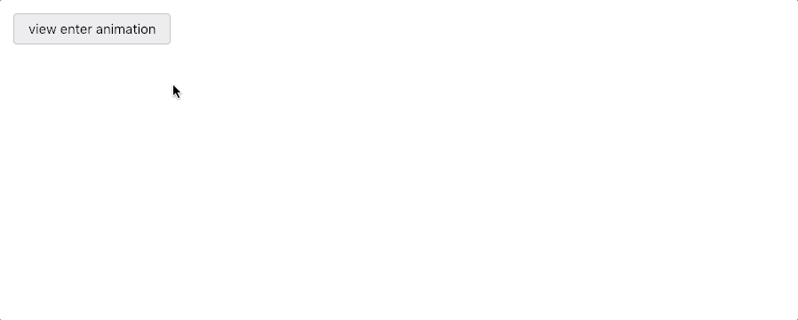

### 🆕 Updated for 2019

# What's the most powerful and developer-friendly React animation library?

### The goal: replicate this animation in React

Here's a rundown of what should happen (it's more complex than it appears at first glance!)

1. When it's first rendered in React, the grid component should animate in from the left, followed by the staggered animation of its child, a list of cards, with each card fading in from above.
2. New cards can be added individually to the cards array, and should be animated in with a "fade up" animation.
3. Individual cards can also be removed from the cards array, and should be animated out with a "fade up" animation as they leave.
4. When the grid component is unmounted, it should wait for its children to animate out before animating itself and leaving the DOM in the opposite direction from where it arrived.
5. In-progress animations should be appropriately cancelled if the enter/exit state is toggled rapidly.
6. If the cards were shuffled, they should still animate out with the expected staggered order.

### Why it's hard

1. The sequenced "enter" and "exit" animations of both a parent and its child requires coordination between different components.
2. The enter and exit animations are not simple mirrors of each other, as some libraries expect.
3. The positions of the grid and cards should be animated with a spring (or, failing that, with an elastic easing), while opacity changes should have a linear easing.
4. The cards animating in and out are initially staggered, but adding or removing cards one-by-one should result in a fluid animation with no delay.
5. The initial staggered entry of cards should have them animating in from the top, but an individual card being added should have its own animation &mdash; fading in from the bottom.
6. Toggling the example rapidly should not create a broken view&mdash; cancelled animations should be cleaned up and there shouldn't be any straggler DOM elements left behind.

### The results, ordered by preference

1. 🥇 **react-transition-group & animejs**

- Using `react-transition-group` and a vanilla JavaScript animation library ended up being my favorite technique, because it offers total flexibility and control, at the cost of some additional complexity.
- `Animejs` is lightweight and open source, and I find its imperative API more intuitive than the typical React approach for coordinated, complex animations.
- [my animation attempt](https://alex.holachek.com/react-animation-comparison/?selectedKind=Animation%20Examples&selectedStory=React-Transition-Group%20%2B%20animejs&full=0&addons=1&stories=1&panelRight=0&addonPanel=storybook%2Factions%2Factions-panel)
- [my code](https://github.com/aholachek/react-animation-comparison/blob/master/src/react-transition-group-anime-example.js)
- [React transition group docs](http://reactcommunity.org/react-transition-group/)
- [Anime docs](https://github.com/juliangarnier/anime)

2. 🥈 **react-spring**

- If you'd prefer to use a React-specific library, I recommend `react-spring`.
- The library's use of the hooks API is very concise and expressive&mdash;it took only about 70 lines of code to implement the example!
- The library is in active development and supports a wide variety of use cases.
- I was unable to get the cards to have different animations depending on whether they were arriving as a group ("fade in down") or as an individually added card ("fade in up").
- [my animation attempt](https://alex.holachek.com/react-animation-comparison/?selectedKind=Animation%20Examples&selectedStory=React-Spring&full=0&addons=1&stories=1&panelRight=0&addonPanel=storybook%2Factions%2Factions-panel)
- [my code](https://github.com/aholachek/react-animation-comparison/blob/master/src/react-spring-example.js)
- [react-spring docs](https://react-spring.surge.sh/)

3. 🥉 **react-transition-group & gsap**

- Basically the same as the `animejs` example, just with the animation library swapped out. `GSAP` has a less permissive license and it's older and heavier than `animejs`, but it's battle-tested and powerful.
- [my animation attempt](https://alex.holachek.com/react-animation-comparison/?selectedKind=Animation%20Examples&selectedStory=React-Transition-Group%20%2B%20GSAP&full=0&addons=1&stories=1&panelRight=0&addonPanel=storybook%2Factions%2Factions-panel)
- [my code](https://github.com/aholachek/react-animation-comparison/blob/master/src/react-transition-group-gsap-example.js)
- [React transition group docs](http://reactcommunity.org/react-transition-group/)
- [GSAP docs](https://greensock.com/docs)

4. **react-pose**

- A year ago, this was my favorite option, but now the number of bugs make me hesitant to recommend it.
- The good:
  - the library API is very user friendly.
  - I liked how the library automatically applies transitions to DOM elements for you instead of just tweening values and making you handle the style updates yourself.
- The bad (bugs):
  - Interrupted repeat animations are implemented incorrectly (extra ghost elements are animated in if the previous animation did not fully complete). Try toggling the example multiple times fairly quickly to see what I mean. [Link to issue](https://github.com/Popmotion/popmotion/issues/318)
  - Shuffling the cards will result in an out-of-order staggered exit transition. [Link to issue](https://github.com/Popmotion/popmotion/issues/319)
  - (Introduced in v4): Individual card animations no longer work correctly.
- [my animation attempt](https://alex.holachek.com/react-animation-comparison/?selectedKind=Animation%20Examples&selectedStory=Popmotion%20Pose&full=0&addons=1&stories=1&panelRight=0&addonPanel=storybook%2Factions%2Factions-panel)
- [my code](https://github.com/aholachek/react-animation-comparison/blob/master/src/popmotion-pose-example.js)
- [React Pose docs](https://popmotion.io/pose/)

5.  **react-move**

- A lightweight library that helps `D3` and `React` work together. It ended up not being quite flexible enough for the needs of this task, though if the demo featured more traditionally D3-like interactions it would have been great.
- [my animation attempt](https://alex.holachek.com/react-animation-comparison/?selectedKind=Animation%20Examples&selectedStory=React-Move&full=0&addons=1&stories=1&panelRight=0&addonPanel=storybook%2Factions%2Factions-panel)
- [my code](https://github.com/aholachek/react-animation-comparison/blob/master/src/react-move-example.js)
- [react-move docs](https://react-move-example.js.org/#/)

6.  **velocity-react**

- A straightforward option that got me far but then ended up tripping me up when it came time to get the nested leave animations working.
- At one point, this library might have been one of the better options for animating in React, but now with `react-spring`, `popmotion-pose`, and `react-transition-group v2` there are more powerful, updated alternatives with better documentation.
- [my animation attempt](https://alex.holachek.com/react-animation-comparison/?selectedKind=Animation%20Examples&selectedStory=Velocity-React&full=0&addons=1&stories=1&panelRight=0&addonPanel=storybook%2Factions%2Factions-panel)
- [my code](https://github.com/aholachek/react-animation-comparison/blob/master/src/velocity-react-example.js)
- [velocity-react docs](https://github.com/google-fabric/velocity-react)

7.  **react-motion**

- I found this library very difficult to use when implementing the example.
- [my sad animation attempt](https://alex.holachek.com/react-animation-comparison/?selectedKind=Animation%20Examples&selectedStory=React-Motion&full=0&addons=1&stories=1&panelRight=0&addonPanel=storybook%2Factions%2Factions-panel)
- [my code](https://github.com/aholachek/react-animation-comparison/blob/master/src/react-motion-example.js)
- [react motion docs](https://github.com/chenglou/react-motion)

## Run the project locally

1. `yarn` or `npm install`
2. `yarn start` or `npm start`
